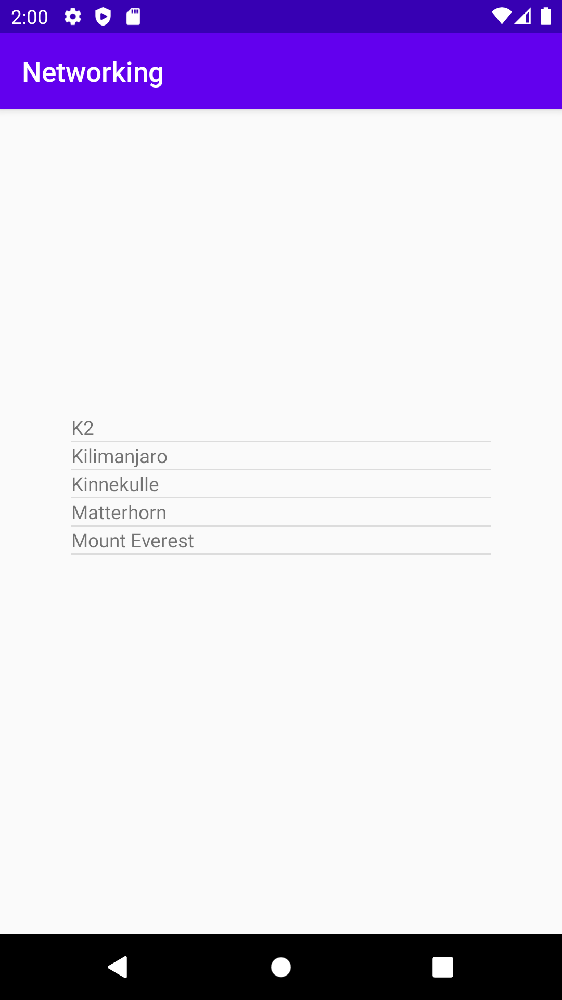

# Assignment 6: Networking

**Rapport**

Den här Assignment handlade om networking och hur man hämtar data från en external länk. Man kunde göra uppgiften på olika sätt, och elever fick välja själv hur de vill lösa uppgiften.
```
    <ListView
        android:id="@+id/my_list_view"
        android:layout_width="307dp"
        android:layout_height="281dp"
        app:layout_constraintBottom_toBottomOf="parent"
        app:layout_constraintEnd_toEndOf="parent"
        app:layout_constraintStart_toStartOf="parent"
        app:layout_constraintTop_toTopOf="parent"
        app:layout_constraintVertical_bias="0.691" />
```
Tidigare i kursen vi lärde oss hur man skapar en ListView i Activity_Main.xml layout. För att fylla data i list items vi borde skapa en ny layout med textView. Fortfarande det syntes inget på ListView och det var på grund av det behövdes en adapter för att kunna koppla ListView till textView. Att skapa adapter och referera den till list_item_textview och sen sätta adaptern till ListView har vi lärt oss tidigare i kursen. Sen vi behövde en OnItemClickListener för att fånga in användarens klick och köra lite kod var också något som vi visste innan.

Det fanns en del kod för networking som vi fick från dugga sidan med lite kommentar att vart måste den ligga. Koden borde klistras in MainActivity men inte inuti någon metod och funktion. För att kunna anropa koden vi borde lägga till en rad kod (_new JsonTask().execute("HTTPS_URL_TO_JSON_DATA");_ ) i onCreate funktionen.

```
 protected void onPostExecute(String json) {
            Log.d("TAG", json);
            try {
                // Ditt JSON-objekt som Java
                JSONArray jsonarray = new JSONArray(json);
                for(int i = 0; i < jsonarray.length(); i++){
                    JSONObject object = jsonarray.getJSONObject(i);
                    String name = object.getString("name");
                    int height = object.getInt("size");
                    String location = object.getString("location");
                    item.add(new Mountain(name, height, location));
                    adapter.notifyDataSetChanged();
                }
            }
        }
```
Först jag gjorde en Log.d på json strängen för att se vilka information finns i json strängen. Jag skapade en JsonArray utav json strängen. Nu jag visste jag har en array så jag skrev en for loop för att loopa igenom det. In i iterationen jag skapade en json object och sen tre variabler (name, height, location). Jag tilldelade mina variabler med värdena som jag visste att finns i Json objektet. Min ArrayList heter item, därför med hjälp av add funktionen jag lag till de variablerna i min ArrayList.

```
 String name= item.get(position).getName("name");
                int height = item.get(position).getHeight("height");
                String location = item.get(position).getLocation("location");
                String msg = name + " is about " + height + " meter. " + "location: " + location + ".";
                Toast.makeText(MainActivity.this, msg, Toast.LENGTH_SHORT).show();
```
Jag hade gjort några getter funktion i min Mountain class, så jag kallar på de med tanke på vilken position(index) har item som användaren klickade på., sen sparar jag värden i en variabel. Jag gjorde en mening utifrån mina variabel och visar de på skärmen med Toast funktion när användaren har klickat på någon berg namn.




